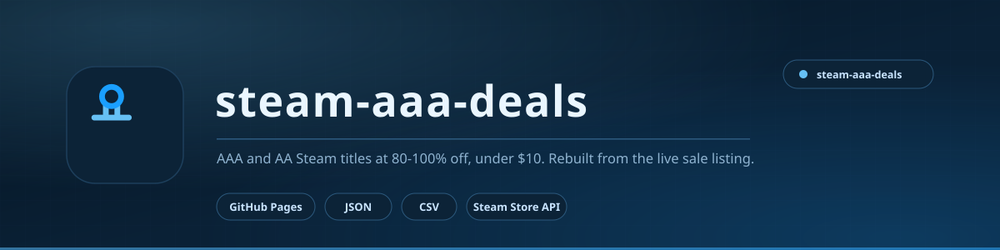

<picture>
  <source media="(prefers-color-scheme: light)" srcset="docs/assets/banner-light.svg">
  <source media="(prefers-color-scheme: dark)" srcset="docs/assets/banner.svg">
  
</picture>

# Steam AAA/AA Deals — 80–100% off, under $10

Auto-generated Steam sale list, filtered to **AAA/AA games only** at **80–100% discount** with a final price **under $10**.

## What's here
- `index.html` — interactive page: search, sort (original price / amount saved / discount % / price / review score), filters (AAA, AA, AAA+AA, review 75%+, trusted picks)
- `data.json` — the tiered dataset behind the page
- `aaa-aa-tiered-under-10.csv` — AAA/AA games with tier, original price, now price, amount saved
- `all-80-100-under-10.csv` — every 80–100% item under $10 (includes indies/DLC)

## How the tiers are assigned
Tier is based on the **original list price** *and* the **Steam user-review count** (so $99.99 shovelware with no reviews is not labelled AAA):

| Tier | Rule |
|---|---|
| AAA | original price >= $39.99 and >= 3,000 reviews |
| AA | original price >= $19.99 and >= 800 reviews |
| A | original price >= $14.99 and >= 300 reviews |

DLC, soundtracks, packs and upgrades are excluded. Prices are USD, Steam region BD.

## Live page
Published with GitHub Pages straight from this branch: **[aizenrexx.github.io/steam-aaa-deals](https://aizenrexx.github.io/steam-aaa-deals/)**. It is one static page, so you can also just open `index.html` locally - no build step, no server.

## Note
Sale prices change at any time — this is a snapshot taken from the Steam sale listing.
